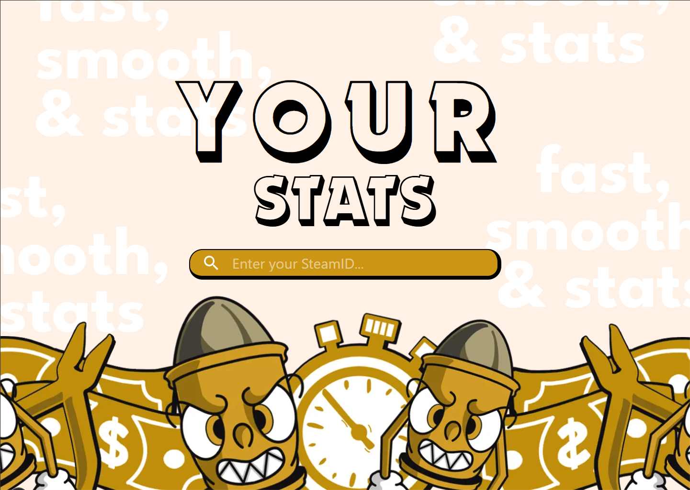
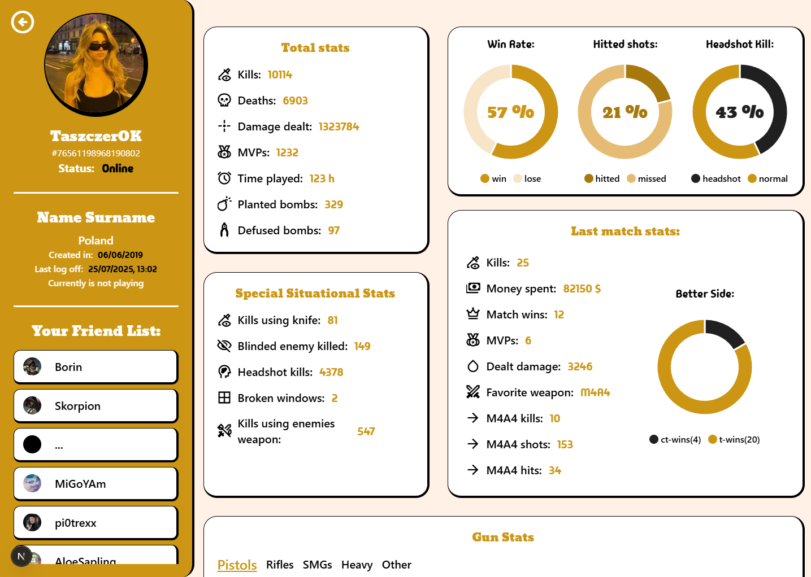

## CS2 & Steam Stats Web App

This project is a web application that provides users with detailed statistics for Counter-Strike 2 (CS2),
along with selected Steam platform data.

## 🛠 Tech Stack

- **Frontend:** Next.js, TypeScript, Tailwind CSS
- **Design Tools:** Figma, Krita
- **API/Data Sources:** [Steam Web API](https://developer.valvesoftware.com/wiki/Steam_Web_API)

## ✨ Features

- Live CS2 player stats

- Steam profile and game information

- Nice and responsive UI

- Fast and efficient performance

## 🎨 Design & Art

The entire website, including UI/UX design, was crafted by me from scratch.  
All illustrations and graphics displayed on the site were hand-drawn by me.

## 📸 Screenshots

## 🔗 Live Demo

Check out the live app: 88888888888

## 🙋‍♂️ About Me

Hi! I'm Dmytrij — a web developer, UI/UX designer, and occasionally a digital artist.
This project is a blend of my passions: gaming, coding, web designe and art.

- Portfolio: ----
